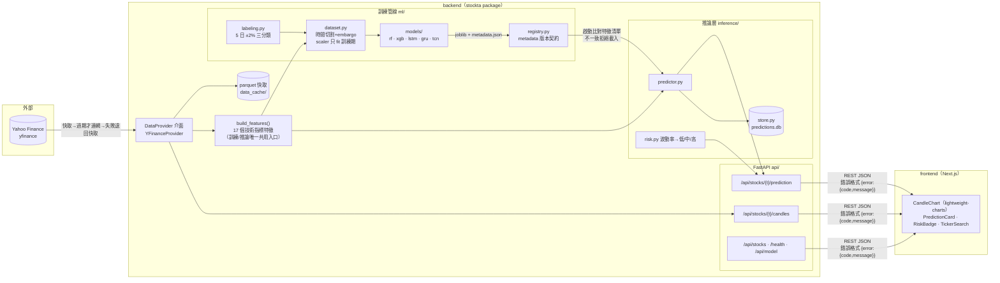

# 系統架構

## 整體架構圖

## 五條架構原則的落點

| 原則 | 落點 |
|---|---|
| 單一 Python package | `stockta/` 可安裝（`pip install -e .`），uvicorn 與 pytest import 路徑一致 |
| 外部資料源藏介面後 | `DataProvider`；訓練/推論/測試只認識介面，測試注入 FakeProvider 不打網路 |
| 訓練產物版本契約 | `registry.py` 存檔寫 metadata（特徵清單/視窗/標籤門檻/auto_adjust），載入逐項比對，不一致拒絕啟動 |
| 特徵管線單一入口 | `build_features()`；`test_feature_parity.py` 保證訓練/推論逐值相等 |
| 設定單一事實來源 | `config.py`；前端股票清單吃 `GET /api/stocks`，不自建副本 |

## 訓練與推論的共用與隔離

- **共用**：DataProvider、build_features、config、registry——特徵計算只有一份程式碼，
  杜絕 training/serving skew。
- **隔離**：`ml/`（訓練，含重相依 torch）與 `api/`（服務）互不 import 對方；
  服務端只透過 registry 載入 artifact。
- **推論基準日**：`last_completed_trading_day()`（台北時區，13:30 收盤後才算當日完成），
  避免盤中拿到未完成 K 棒；抓取範圍 = 視窗 60 + 指標暖機 120 + 緩衝。

## 資料流（一次 /prediction 請求）

1. `deps.py` 白名單驗證 ticker（防路徑穿越，ticker 會進快取檔名）
2. Provider 取 OHLCV（快取新鮮→直接用；過期→連網更新；連網失敗→退回快取）
3. `build_features()` → 取最後 60 日視窗 → scaler（artifact 內）→ 模型 predict_proba
4. `risk.py` 以近 60 日年化波動率換算風險等級
5. 預測落地 `predictions.db`（同 ticker+基準日+版本去重）——累積線上實證
6. 回傳 `{signal, confidence, risk, model_version, base_date}`

> 環境備註：專案路徑含中文時 libcurl 讀不到 venv 內 CA 憑證，
> `config.py` 啟動時自動複製 cacert.pem 至 ASCII 路徑並設 `CURL_CA_BUNDLE`。
